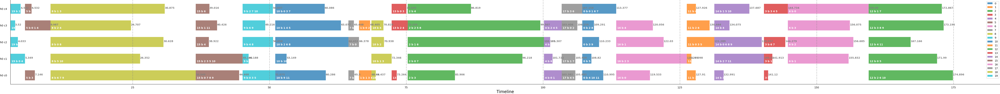
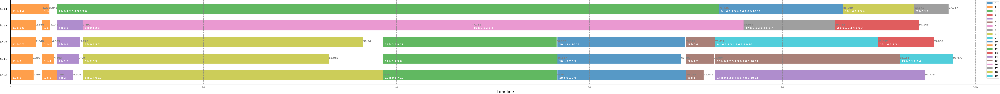
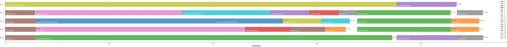
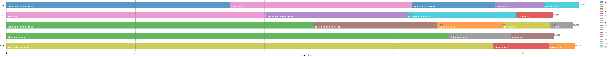
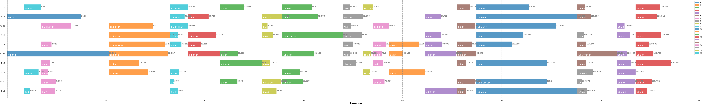
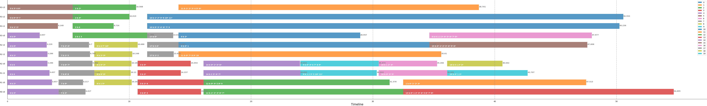
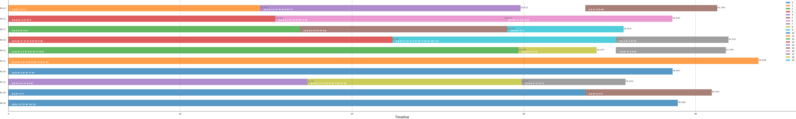

# Resource Scheduling

- **Author**: Junyi Cao
- **Last modified time**: December, 2021
- **Description**: This is a cource project for *Algorithm Design and Analysis (Fall 2021) @ SJTU*. It focuses on resource scheduling problem in Hadoop. The detailed problem definition is shown [here](Project-Description.pdf). 

### Scheduling samples
#### Task 1
- **Monte Carlo Method**
*Finish Time: 174.895823, Utilization rate: 0.637134*
 
- **Optimized Monte Carlo Method**
*Finish Time: 97.677237, Utilization rate: 0.947536*
 
- **Balance Scheduling Method**
*Finish Time: 92.039320, Utilization rate: 0.972552*
 
- **Single-core Scheduling Method**
*Finish Time: 88.783969, Utilization rate: 0.978165*
 

#### Task 2
- **Monte Carlo Method**
*Finish Time: 134.340509, Utilization rate: 0.383833*
 
- **Optimized Monte Carlo Method**
*Finish Time: 54.695493, Utilization rate: 0.774518*
 
- **Balance Scheduling Method**
*Finish Time: 43.666000, Utilization rate: 0.899359*
 
- **Single-core Scheduling Method**
*Finish Time: 73.516000, Utilization rate: 0.527397*
 


### Running
```bash
python main.py -m ${METHOD} -i ${INPUT_NAME}
```